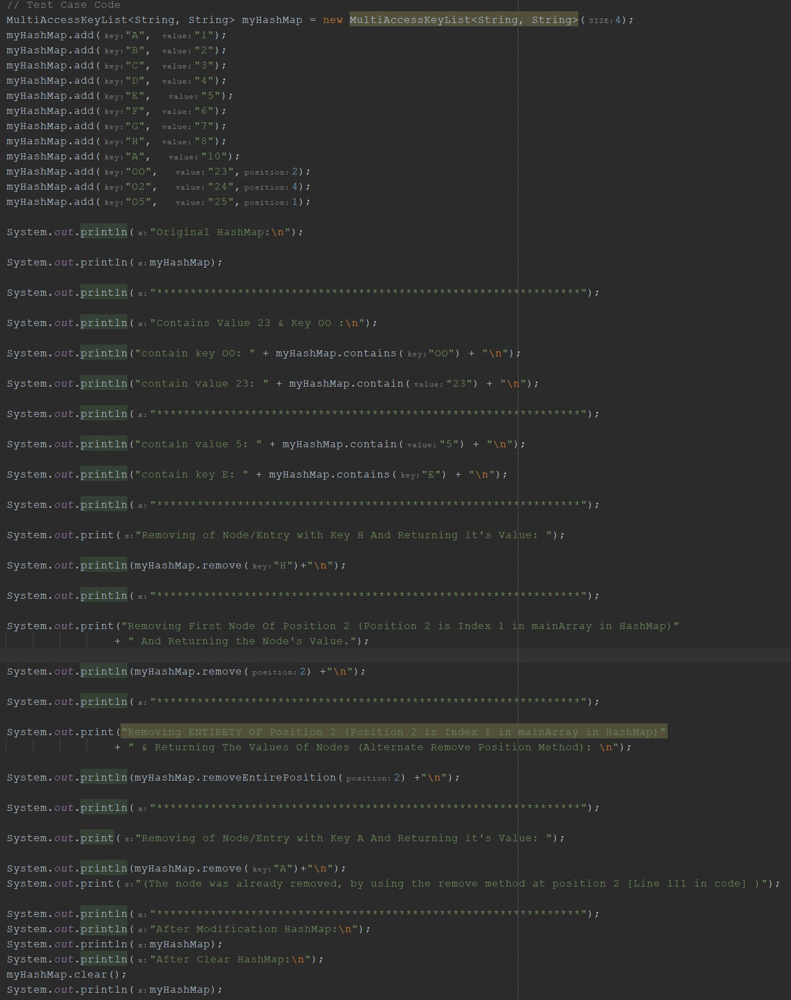
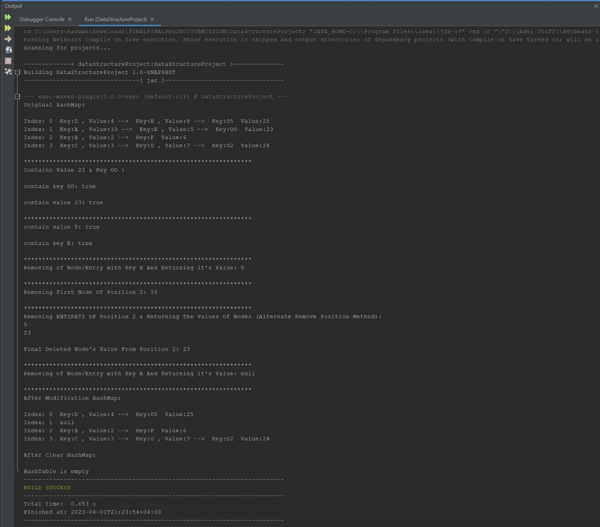

 <h1 align=center> <u>Report:</u> </h1>

<h2 align = center> - **<u>General Structure:</u>** </h2>

 The general structure for the project (HashMap) is as follows:
 
 It relies on a main array that stores LinkedList of nodes (MainArray of
 type Node), the node’s location in the main array is based on the Key
 parameter, which when hashed, determines where the array will be stored,
 or the user can provide a position to store the node itself to a certain
 position on the array. In case any collusion occurs, it will start a
 LinkedList of nodes at the index of collusion in the main array. The
 project also has read and write methods, where it reads a file called
 “Project_Test_Data.csv” and adds them to the HashMap and saves output of
 the hashMap to a “Project_Test_DataOUTPUT.csv”, all in the same default
 file directory as the project. It also contains an inner class called
 Node with an ADT of LinkedList Nodes.

<h2 align = center> - **<u>Method Explanation & Big O Notation:</u>** </h2>

<!-- -->

- *+add (position: integer, key: K, value: V): void*

 Description: The method adds a node containing key and value to a
 specific position, if that position is empty (no other nodes exist at
 that position) it will add it as the first node. If there are existing
 nodes, it will navigate to the end of LinkedList, while simultaneously
 checking if the added key matches any of the other keys in that
 position. If it finds an exact match, it will update the value of the
 node and exit the method, if not, it will navigate to the end of the
 LinkedList and add it at the end of it.
 
 Best Case: O(1), Empty index and adds it to that position.
 
 Avg Case: O(1), If the array is of sufficient size, the amount of
 collisions, should negligible.
 
 Worst Case: O(n), If the array at that position had an existing
 LinkedList, it would navigate to the end of it and then add it (unless
 it found a matching key, then it will update it).

- *+add (key: K, value: V): void*

 Description: Adds a node of Key and value to a position determined by
 hash value from the key and adds it to said position. Other than that,
 it operates exactly like the previous add method.
 
 Best Case: O(1), Empty index and adds it to that position.
 
 Avg Case: O(1), If the array is of sufficient size, the amount of
 collisions, should negligible. If the array size is significantly
 smaller than the additions performed by the user, then it would be O(n).
 
 Worst Case: O(n), If the array at that position had an existing
 LinkedList, it would navigate to the end of it and then add it (unless
 it found a matching key, then it will update it).
 
 \*\*Since there was no specification regarding the behavior of the
 remove function, I’ve made two alternative methods to be chosen at the
 user’s discretion as a precaution.

- *+remove (position: integer): V*

 Description: Access the main array at the user specified position and
 removing the first entry in the LinkedList in the main array position
 and returns its value, if there are no entries in that specific
 position, return null.
 
 Best Case, Avg Case, Worst Case: O(1)

- *+removeEntirePosition(position: integer): V*

 Description: Access the main array at the user specified position and
 sets the LinkedList at that position to null, basically removing all
 entries, while printing all the values in that LinkedList to the user
 and returning the value of last deleted node (which is the last node in
 the LinkedList.
 
  Best Case, Avg Case: O(1), If there are a couple or no nodes at that
  position.
  
  Worst Case: O(n), If ,for any reason, all nodes are in that position, it
  will iterate through N amount of nodes in that specific entry.

- *+remove (key: K): V*

Description: Access the main array position using the key’s hashing
value as an index and then navigates the LinkedList till its find’s a
matching key and removes it, returning it’s value. If there isn’t, it
will begin sequential search for all array positions and their
LinkedLists.

  Best Case: O(1), If the position in the main array is empty, then
  return null or if it’s first item in the LinkedList in that position.
 
  Avg Case: O(1), If there is a LinkedList at that specific entry, it
  will remove the node from it (Usually the amount of nodes in the
  LinkedList is negligible to affect Big O).
 
  Worst Case: O(n), if the key isn’t matching with any of the LinkedList
  nodes at the key’s hashing position, it would begin a sequential
  search dependent on size N of the array (Usually the amount of nodes
  in the LinkedList is negligible to affect Big O). If a large of amount
  of nodes are added to a single entry it is would navigate N amount of
  nodes as well resulting in \[ O(n) \].

<!-- -->

- *+clear (): void*

 Description: Sets the main array that contains all nodes to size a new
 array of type node with size zero, removing all references to previous
 data.
 
  Best Case, Avg Case, Worst Case: O(1)

<!-- -->

- *+contains(value: V):boolean*

 Description: Begins a sequential search in all the main array and it’s
 LinkedLists for the matching value provided by the user, if it finds the
 value then it returns true. If it doesn’t find it, returns false.

  Best Case: O(1), If the element is in the first position in the array
  and it’s the first node.

  Avg Case, Worst Case: O(n), If the element is in the middle or the end
  of the main array with size N (Usually the amount of nodes in the
  LinkedList is negligible to affect Big O). If a large of amount of
  nodes are added to a single entry it is would navigate N amount of
  nodes as well resulting in \[ O(n) \].

<!-- -->

- *+contains(key: K):boolean*

Description: the method takes the input key from the user and calculates
the position in the main index based on its hash value and then
navigates a LinkedList to find the node. if it doesn’t find it, it
begins a sequential search in the array.

  Best Case: O(1), If the node is in its hashed position (based on it’s
  key) in the array and it’s the first node.

  Avg Case: O(1), If there is a LinkedList at that specific entry, it
  will remove the node from it (Usually the amount of nodes in the
  LinkedList is negligible to affect Big O).

  Worst Case: O(n), if the key isn’t matching with any of the LinkedList
  nodes at the key’s hashing position, it would begin a sequential
  search dependent on size N of the array (Usually the amount of nodes
  in the LinkedList is negligible to affect Big O). If a large of amount
  of nodes are added to a single entry it is would navigate N amount of
  nodes as well resulting in \[ O(n) \].

*\*\*Footnote: I also included two toString methods in both Node and
MultiAccessKeyList class, where the commented one is in case you wanted
it to be printed as CSV file, and the other method in-use is more
legible and readable but is reading data from it becomes more difficult
because of the way the data is formatted. There are other methods used
in the main Class where it reads data from the file that were not
discussed in depth.*

*\*\*\*P. S: In the project comments and codes, the term nodeList is
exactly the same as the LinkedList…  
*

<h2 align = center>- **<u>Test Cases Screenshot:</u>** </h2>

Test Case Code:

Test Case Output: 

<h2 align = center>- **<u>References & Resources:</u>**  </h2>

<!-- -->

- A StackOverFlow post was used to fix an error in the toString method
  using in-built java method String Builder, which resolved the issue.

- References used were the course’s book and slides provided by the
  instructor and the lab material.
